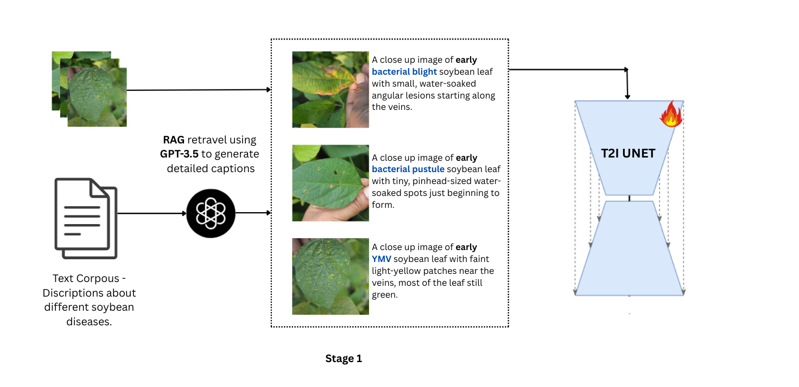
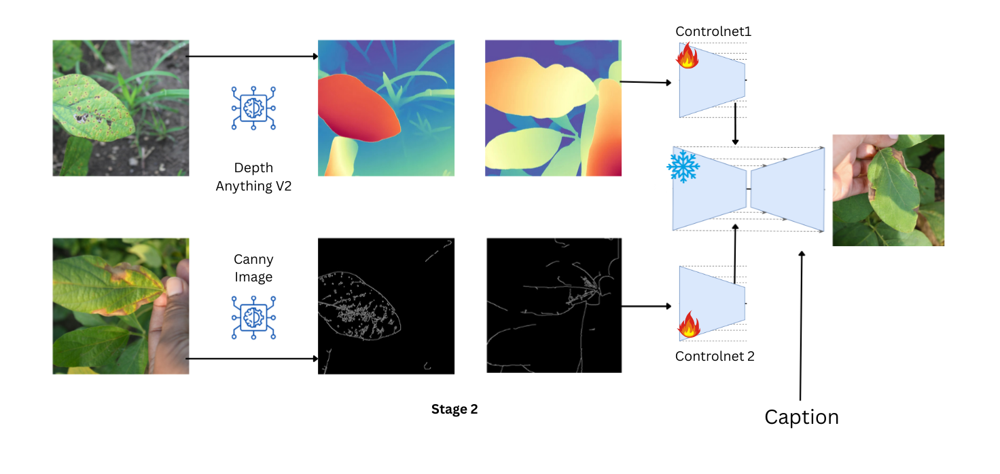

Of course. Here is a rewritten README.md that reflects your work on generative augmentation for plant disease diagnosis, incorporating the architectural images and performance improvements.

<h1>Generative Augmentation for Explainable Plant Disease Diagnosis</h1>

This repository contains the official implementation of our framework for addressing data scarcity in agriculture through advanced generative augmentation. We leverage state-of-the-art diffusion models to generate high-fidelity, explainable images for early plant disease diagnosis.

Our approach integrates several key technologies to ensure generated data is not only realistic but also diagnostically relevant:

Domain-Specific Generation: We use a Retrieval-Augmented Generation (RAG) system to dynamically inject specific plant pathology knowledge into text prompts, guiding the diffusion model to create accurate disease symptoms.

Anatomical Consistency: A ControlNet model, conditioned on depth and canny edges, preserves the precise botanical structures of leaves and stems, preventing anatomical distortions.

Explainable Diagnosis: A Vision-Language Model (VLM), fine-tuned with contrastive loss, aligns the visual features of generated symptoms with textual diagnostic criteria, creating an end-to-end explainable solution.

System Architecture
Our framework is composed of two main stages: a RAG-enhanced generation pipeline and a VLM-based validation loop.

<em>Figure 1: The RAG-ControlNet Pipeline for Symptom Generation.</em>

<em>Figure 2: The End-to-End Explainable Diagnosis and Validation Framework.</em>

Performance and Results
Our method significantly improves upon baseline generative models. By integrating domain knowledge and structural controls, we enhance the realism and accuracy of the generated images, leading to a substantial improvement in Fréchet Inception Distance (FID).

Our model achieves a FID score of 20, a 37.5% improvement over the baseline FID of 32.

Installation
To get started, clone the repository and install the required dependencies in a virtual environment.

Bash

git clone https://github.com/your-username/your-repo-name.git
cd your-repo-name
pip install -r requirements.txt
This project is built on PyTorch. Please refer to the official PyTorch documentation for installation details specific to your hardware.

Quickstart
Once installed, you can generate an augmented image with just a few lines of code. The following example demonstrates how to generate an image of a tomato leaf with early blight symptoms.

Python

from plant_augmentor import PlantDiseaseAugmentor
from PIL import Image

# Initialize the augmentation pipeline
augmentor = PlantDiseaseAugmentor.from_pretrained("path/to/your/model_checkpoint")
augmentor.to("cuda")

# Define the disease and conditions
prompt = "A tomato leaf showing early signs of Alternaria solani (early blight), with small dark lesions."
base_image_path = "path/to/healthy/leaf.jpg"

# Generate the image
generated_image = augmentor.generate(
    prompt=prompt,
    control_image=Image.open(base_image_path)
)

generated_image.save("augmented_tomato_leaf_early_blight.png")
Contribution
We welcome contributions from the open-source community! If you are interested in contributing, please check out our Contribution guide and look for open issues to tackle.

Also, feel free to say 👋 in our public Discord channel  to discuss ideas, personal projects, or just hang out ☕.

Acknowledgements
This work would not be possible without the foundational Hugging Face 🤗 Diffusers library. We extend our sincere thanks to the authors and contributors of the following works that inspired and enabled our research:

The original diffusers library available here.

The research on ControlNet by Lv et al., available here.

The broader research community working on diffusion models and vision-language pre-training.

Citation
If you use this work in your research, please cite it as follows:

Code snippet

@misc{vashistha-etal-2024-gen-augment,
  author = {Saransh Vashistha and Co-authors},
  title = {Generative Augmentation for Explainable Plant Disease Diagnosis},
  year = {2024},
  publisher = {GitHub},
  journal = {GitHub repository},
  howpublished = {\url{https://github.com/your-username/your-repo-name}}
}
